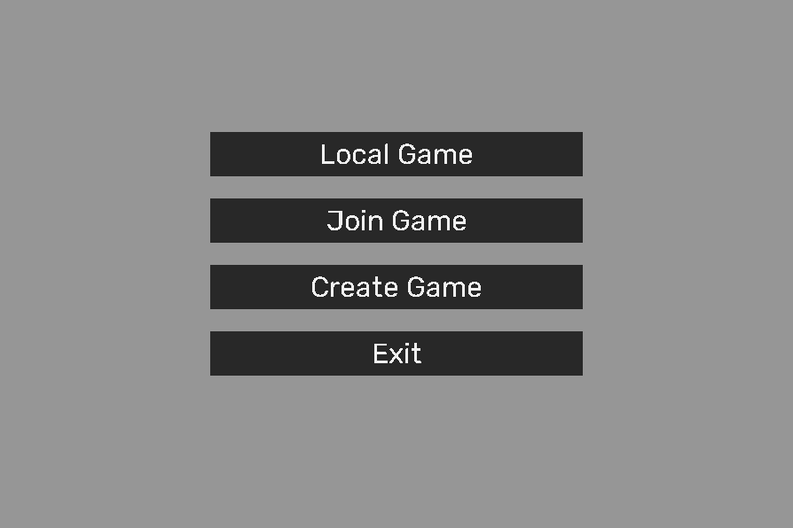

# Chess
This is chess made in C language with SDL2.

 
 
 

# Features

## Menu

 
 
 

## Game on local computer

 
 
 

## Game through network
Currently default connection is on 6969 port, on localhost address.

 
 
 

# TODO
- Input to connect network game on different addresses and ports
- Turn bar on right panel
- Maybe add timer
- App icon

 
 
 

# Used libraries
- SDL2:       https://www.libsdl.org/
- SDL2_image: https://github.com/libsdl-org/SDL_image
- SDL2_ttf:   https://github.com/libsdl-org/SDL_ttf/releases